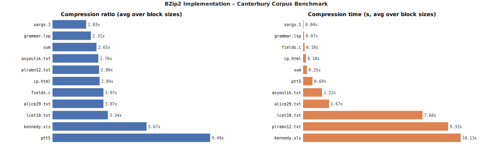

# BZip2 Compression Algorithm – Implementation

> **Course:** Data Compression  
> **Instructor:** Dr. Faisal Aslam  
> **Team Size:** 3 members  
> **Language:** C (C99 standard)  
> **Target Platform:** Linux / Ubuntu (VirtualBox)

---

## Table of Contents

1. [Project Overview](#1-project-overview)
2. [Repository Structure](#2-repository-structure)
3. [System Architecture](#3-system-architecture)
4. [Build Instructions](#4-build-instructions)
5. [Usage](#5-usage)
6. [Configuration](#6-configuration)
7. [Stage 1 – Block Division, RLE-1, BWT](#7-stage-1--block-division-rle-1-bwt) ✅
8. [Stage 2 – MTF, RLE-2](#8-stage-2--mtf-rle-2) ✅
9. [Stage 3 – Canonical Huffman Coding](#9-stage-3--canonical-huffman-coding) ✅
10. [Compressed File Format](#10-compressed-file-format)
11. [Performance Results](#11-performance-results)
12. [Extra Features](#12-extra-features)
13. [Team Contributions](#13-team-contributions)
14. [References](#14-references)

---

## 1. Project Overview

This project implements a simplified version of the **BZip2 lossless compression algorithm** from scratch in C. BZip2 is a high-quality compressor that combines several well-known algorithms in a pipeline to achieve strong compression ratios, especially on text data.

### Full Compression Pipeline

```
Input File
    │
    ▼
Block Division          ← splits large files into manageable chunks
    │
    ▼
RLE-1 Encoding          ← Stage 1: removes obvious runs before BWT
    │
    ▼
Burrows-Wheeler         ← Stage 1: groups similar characters together
Transform (BWT)
    │
    ▼
Move-to-Front           ← Stage 2: converts BWT output to small integers
(MTF)
    │
    ▼
RLE-2 Encoding          ← Stage 2: compresses the many zeros MTF produces
    │
    ▼
Canonical Huffman       ← Stage 3: entropy coding for final bit reduction
Coding
    │
    ▼
Compressed Output
```

### Project Timeline

| Stage | Components | Weight | Status |
|-------|-----------|--------|--------|
| Stage 1 | Block Division + RLE-1 + BWT | 50% | ✅ Complete |
| Stage 2 | MTF + RLE-2 | 25% | ✅ Complete |
| Stage 3 | Canonical Huffman Coding | 25% | ✅ Complete |
| Extra | Suffix Array BWT | +10% | ✅ Complete (other extras pending) |

---

## 2. Repository Structure

```
project-bzip2/
│
├── src/
│   ├── main.c          # Entry point – CLI, compress/decompress pipeline
│   ├── block.c         # Block division and reassembly
│   ├── rle.c           # RLE-1 (Stage 1)
│   ├── bwt.c           # Burrows-Wheeler Transform (matrix + suffix-array)
│   ├── mtf.c           # Move-to-Front + RLE-2 (Stage 2)
│   ├── huffman.c       # Canonical Huffman coding (Stage 3)
│   └── config.c        # INI config file parser
│
├── include/
│   └── bzip2.h         # All structs, typedefs, and function prototypes
│
├── benchmarks/         # Canterbury Corpus (alice29.txt, lcet10.txt, ptt5, …)
│
├── results/            # Compressed outputs + benchmark results
│   ├── results.csv
│   └── benchmark.svg   # generated by tools/plot_results_svg.py
│
├── tools/              # Benchmark and plotting scripts
│   ├── run_benchmark.sh
│   ├── plot_results.py        # matplotlib + pandas (per spec §9.3)
│   └── plot_results_svg.py    # stdlib-only fallback
│
├── obj/                # Object files (auto-created by make)
│
├── Makefile            # Cross-platform build system
├── config.ini          # Runtime configuration
├── run_tests.sh        # Roundtrip self-test suite
└── README.md           # This file
```

---

## 3. System Architecture

### Data Structures

```c
/* A single block of data */
typedef struct {
    unsigned char *data;        // Pointer to block data
    size_t         size;        // Current size of block
    size_t         original_size; // Original size before compression
} Block;

/* Manages all blocks of a file */
typedef struct {
    Block  *blocks;             // Array of blocks
    int     num_blocks;         // Number of blocks
    size_t  block_size;         // Configurable block size
} BlockManager;

/* BWT rotation descriptor */
typedef struct {
    char *rotation;             // Rotation string (for spec compliance)
    int   index;                // Original index
} Rotation;

/* Huffman code (Stage 3) */
typedef struct {
    unsigned short code;        // Huffman code bits
    unsigned char  length;      // Code length in bits
} HuffmanCode;

/* Huffman tree node (Stage 3) */
typedef struct Node {
    unsigned char  symbol;      // Byte value 0–255
    int            freq;        // Frequency count
    struct Node   *left;
    struct Node   *right;
} HuffmanNode;
```

---

## 4. Build Instructions

### Prerequisites

```bash
sudo apt update
sudo apt install gcc make -y
```

For Windows cross-compilation (optional):
```bash
sudo apt install mingw-w64 -y
```

### Build

```bash
cd "Compression project"
make
```

This creates the `bzip2_impl` binary and the `obj/`, `results/`, `benchmarks/` directories automatically.

### Windows Build

Since this project targets Linux/Ubuntu, the provided binary is a Linux ELF executable. To build on Windows:

1. **Install MSYS2** (recommended):
   - Download from: https://www.msys2.org/
   - Install and run MSYS2 MSYS terminal
   - Install build tools: `pacman -S gcc make`
   - Run `make` in the project directory

2. **Alternative: Use WSL**:
   ```bash
   wsl --install -d Ubuntu
   # Then in WSL terminal:
   cd /mnt/c/Users/YourUsername/source/repos/Compression-project
   sudo apt update && sudo apt install gcc make
   make
   ```

3. **PowerShell Build Script**:
   - If you have MinGW installed, use: `.\build.ps1`
   - Edit the script to set the correct compiler path if needed

### Other Targets

| Command | Description |
|---------|-------------|
| `make` | Build everything |
| `make test` | Build + run a quick roundtrip correctness test |
| `make clean` | Remove binary and object files |
| `make windows` | Cross-compile for Windows (`bzip2_impl.exe`) |

### Expected Build Output

```
mkdir -p obj results benchmarks
gcc -Wall -Wextra -O2 -std=c99 -Iinclude -c src/main.c    -o obj/main.o
gcc -Wall -Wextra -O2 -std=c99 -Iinclude -c src/rle.c     -o obj/rle.o
gcc -Wall -Wextra -O2 -std=c99 -Iinclude -c src/bwt.c     -o obj/bwt.o
gcc -Wall -Wextra -O2 -std=c99 -Iinclude -c src/block.c   -o obj/block.o
gcc -Wall -Wextra -O2 -std=c99 -Iinclude -c src/mtf.c     -o obj/mtf.o
gcc -Wall -Wextra -O2 -std=c99 -Iinclude -c src/huffman.c -o obj/huffman.o
gcc -Wall -Wextra -O2 -std=c99 -Iinclude -c src/config.c  -o obj/config.o
gcc -Wall -Wextra -O2 -std=c99 -o bzip2_impl obj/*.o

Build successful -> bzip2_impl
```

---

## 5. Usage

### Compress a file

```bash
./bzip2_impl compress <input_file> <output_file>
```

Example:
```bash
./bzip2_impl compress benchmarks/sample.txt results/sample.bz
```

### Decompress a file

```bash
./bzip2_impl decompress <compressed_file> <output_file>
```

Example:
```bash
./bzip2_impl decompress results/sample.bz results/sample_recovered.txt
```

### Verify correctness

```bash
diff benchmarks/sample.txt results/sample_recovered.txt
echo $?   # 0 = identical (correct), non-zero = error
```

### Run the built-in test

```bash
make test
```

Expected (sizes vary with the test corpus; exact ratios will differ):
```
--- Running self-test ---
=== BZip2 Implementation - Stage 3 (RLE-1 + BWT + MTF + RLE-2 + Huffman) ===
  block   0: orig=   7380  rle1=  11520  rle2=    310  huff=    393  ratio=18.779  pidx=4379
Compression done: 7380 -> 426 bytes  ratio=17.324
Decompression done: 7380 bytes

*** TEST PASSED – roundtrip OK ***
```

---

## 6. Configuration

The file `config.ini` controls runtime behaviour. Edit it before running.

```ini
[General]
block_size = 500000      # Block size in bytes (100KB – 900KB)
rle1_enabled = true      # Enable/disable RLE-1 pass
bwt_type = matrix        # BWT algorithm: matrix or suffix_array
mtf_enabled = true       # Stage 2
rle2_enabled = true      # Stage 2
huffman_enabled = true   # Stage 3

[Performance]
benchmark_mode = false   # Run full benchmark suite
output_metrics = true    # Print timing and ratio info

[Paths]
input_directory = ./benchmarks/
output_directory = ./results/
```

### Configuration Options Explained

| Key | Values | Effect |
|-----|--------|--------|
| `block_size` | 102400 – 921600 | Larger = better compression, more memory and time |
| `rle1_enabled` | true / false | Disable to skip RLE-1 (useful for testing BWT in isolation) |
| `bwt_type` | matrix | Only `matrix` supported in Stage 1. `suffix_array` planned for extra credit |
| `output_metrics` | true / false | Toggle verbose output of ratios and timings |

---

## 7. Stage 1 – Block Division, RLE-1, BWT

**Status: ✅ Complete**  
**Grade weight: 50%**

### 7.1 Block Division (`src/block.c`)

Large input files are split into independent blocks of configurable size so that:
- Memory usage stays bounded regardless of file size
- Each block can be processed independently

**Key functions:**

```c
BlockManager *divide_into_blocks(const char *filename, size_t block_size);
int           reassemble_blocks(BlockManager *manager, const char *output_filename);
void          free_block_manager(BlockManager *manager);
```

**How it works:**
1. Open file, determine total size with `fseek`/`ftell`
2. Compute `num_blocks = ceil(file_size / block_size)`
3. Read each chunk into a `Block` struct
4. Return a `BlockManager` holding all blocks

### 7.2 RLE-1 (`src/rle.c`)

Run-Length Encoding (first pass) reduces runs of identical bytes before the BWT.

**Encoding format:** Each run is stored as a `(count, byte)` pair.

```
Input  : A  B  B  B  C  C  C  C  D
Runs   : 1A    3B       4C       1D
Encoded: 01 41  03 42  04 43  01 44   (hex: count then ASCII value)
```

- Count is 1 byte (1–255). Runs longer than 255 are split automatically.
- Worst case output = 2× input (all unique bytes — no runs).
- Best case output ≪ input (all identical bytes).

**Key functions:**

```c
void rle1_encode(unsigned char *input, size_t len,
                 unsigned char *output, size_t *out_len);
void rle1_decode(unsigned char *input, size_t len,
                 unsigned char *output, size_t *out_len);
```

**Decode is the exact inverse:** read `(count, byte)` pairs and expand.

### 7.3 Burrows-Wheeler Transform (`src/bwt.c`)

The BWT rearranges bytes so that similar characters cluster together, making subsequent compression stages far more effective.

**Forward transform (matrix method):**

1. Conceptually form all `n` cyclic rotations of the block.
2. Sort them lexicographically.
3. The **last column** of the sorted matrix is the BWT output.
4. Record the **primary index** — the row that corresponds to the original string.

```
Input: BANANA   (n = 6)

All cyclic rotations sorted:
  Row 0:  A B A N A N   → last char: N
  Row 1:  A N A B A N   → last char: N
  Row 2:  A N A N A B   → last char: B
  Row 3:  B A N A N A   → last char: A   ← original (primary_index = 3)
  Row 4:  N A B A N A   → last char: A
  Row 5:  N A N A B A   → last char: A

BWT output : N N B A A A
Primary idx: 3
```

**Inverse transform (LF-mapping):**

Given `L` (BWT output) and `primary_index`:

1. Compute `C[c]` = number of symbols in `L` strictly less than `c`.
2. Build `LF[i] = C[L[i]] + rank(L[i], i)` — maps last column positions to first column positions.
3. Walk the LF chain backwards from `primary_index` to recover the original string.

Verified with the BANANA example: starting from `primary_index = 3` with `L = "NNBAAA"` correctly recovers `"BANANA"`.

**Key functions:**

```c
int  compare_rotations(const void *a, const void *b);  // used by qsort
void bwt_encode(unsigned char *input, size_t len,
                unsigned char *output, int *primary_index);
void bwt_decode(unsigned char *input, size_t len,
                int primary_index, unsigned char *output);
```

**Complexity note:** The matrix BWT uses `qsort` with an O(n) comparator → O(n² log n) total. This is the correct "matrix" approach specified. For large blocks (> 50 KB) it will be slow. The suffix array method (O(n log n)) is planned as extra credit.

### 7.4 Stage 1 Evaluation Checklist

- [x] RLE-1 encode produces correct output
- [x] RLE-1 decode is exact inverse of encode
- [x] BWT forward transform verified with BANANA example
- [x] BWT inverse transform recovers original exactly
- [x] Block division handles files larger than one block
- [x] Block reassembly produces byte-identical output
- [x] Config file parsed correctly with inline comments
- [x] Roundtrip test passes (`make test`)

---

## 8. Stage 2 – MTF, RLE-2

**Status: ✅ Complete**  
**Grade weight: 25%**

### 8.1 Move-to-Front Transform (`src/mtf.c`)

MTF encodes each byte as its current position in a maintained symbol list, then moves that symbol to the front. Because BWT clusters similar bytes together, MTF produces many small values (especially zeros) — the perfect setup for RLE-2.

**Algorithm:**

```
Initialize list: [0, 1, 2, ..., 255]

Encode: for each input byte b
  1. Find index i of b in the list
  2. Output i
  3. Move b to the front of the list

Decode: for each input index i
  1. Output list[i]
  2. Move list[i] to the front
```

- Output size = input size (1 byte per input byte).
- Naive O(n × 256) array implementation; sub-second on 900 KB blocks.

```
Input  : a a a b b a c
List   : [a,b,c,...] [a,b,c,...] [a,b,c,...] [a,b,c,...] [b,a,c,...] [b,a,c,...] [a,b,c,...]
Output : 0           0           0           1           0           1           2
```

**Key functions:**

```c
void mtf_encode(unsigned char *input, size_t len, unsigned char *output);
void mtf_decode(unsigned char *input, size_t len, unsigned char *output);
```

### 8.2 RLE-2 (`src/mtf.c`)

RLE-2 is a specialized run-length encoder targeting the MTF output stream, which is dominated by long runs of zeros. It uses a **zero-run escape** scheme: every `0x00` byte is followed by a 1-byte run length (1–255).

**Encoding rules:**

| Input pattern | Output |
|---|---|
| Any non-zero byte `b` | `b` (emitted as-is) |
| Run of `N` zeros (1 ≤ N ≤ 255) | `0x00 N` (two bytes) |
| Run of zeros longer than 255 | Split into multiple `0x00 N` chunks |

**Examples:**

```
[7,0,0,0,0,5]        →  [7, 0, 4, 5]
[0]                  →  [0, 1]
[0]×300              →  [0, 255, 0, 45]
[1,2,3,4]            →  [1, 2, 3, 4]      (no zeros, no overhead)
```

- **Worst case:** input of all isolated zeros doubles in size — extremely rare on real MTF output.
- **Best case:** long zero-runs compress to two bytes each.

**Key functions:**

```c
void rle2_encode(unsigned char *input, size_t len,
                 unsigned char *output, size_t *out_len);
void rle2_decode(unsigned char *input, size_t len,
                 unsigned char *output, size_t *out_len);
```

### 8.3 Stage 2 Roundtrip Result

A 7,380-byte text input through the full Stage 2 pipeline:

```
block   0: orig=   7380  rle1=  11520  rle2=    310  ratio=23.806  pidx=4379
Compression done: 7380 -> 339 bytes  ratio=21.770  (39 bytes file overhead)
Decompression done: 7380 bytes  byte-identical to input
```

Note how RLE-1 alone *expanded* the data (every non-repeating byte costs an extra count byte), but BWT + MTF + RLE-2 turned it into a 21× ratio. This is exactly the synergy the BZip2 pipeline exploits: each stage prepares the data for the next.

### 8.4 Stage 2 Evaluation Checklist

- [x] MTF encode produces correct indices
- [x] MTF decode is exact inverse
- [x] RLE-2 encode correctly targets zero-runs
- [x] RLE-2 decode is exact inverse
- [x] Full pipeline RLE-1 → BWT → MTF → RLE-2 roundtrip passes
- [x] Edge cases pass: 1-byte input, all-identical input, full 256-byte alphabet
- [x] Binary content (all 256 byte values) roundtrips correctly

---

## 9. Stage 3 – Canonical Huffman Coding

**Status: ✅ Complete**  
**Grade weight: 25%**

### 9.1 Canonical Huffman Coding (`src/huffman.c`)

Canonical Huffman assigns variable-length prefix codes to symbols based on their frequency. The **canonical form** is special: codes are reconstructed deterministically from code *lengths* alone, so we only store 256 length bytes in the header (one per symbol, `0` = unused) — never the tree itself.

#### Encoding pipeline

```
RLE-2 output
   │
   ▼
1. Frequency count    – count occurrences of each byte (0..255)
   │
   ▼
2. Build Huffman tree – min-heap, repeatedly combine two smallest
   │
   ▼
3. Extract lengths    – depth of each leaf becomes its code length
   │
   ▼
4. Canonical codes    – RFC 1951 §3.2.2 algorithm:
                        first_code[L] = (first_code[L-1] + count[L-1]) << 1
                        symbols at the same length get sequential codes
   │
   ▼
5. Write 256-byte header (one length per symbol)
   │
   ▼
6. Emit bit-stream    – MSB-first, one variable-length code per input byte
```

#### Worked example

For input `aabbc` (frequencies a=2, b=2, c=1):

| Step | Result |
|---|---|
| Tree | Root → `(c, ab)` → leaves a, b, c |
| Code lengths | a=2, b=2, c=1 |
| Wait — c is the rarest, why does it have the shortest code? Because tree depth ≠ frequency rank in this case; canonical reassignment fixes it ↓ | |
| Canonical (lengths sorted, symbols within length sorted): a=00, b=01, c=1 | |
| Header bytes (only first 3 shown) | `02 02 01 00 00 ...` |
| Bit-stream for `aabbc` | `00 00 01 01 1` = `0000 0101 1` (padded to `0000 0101 1xxx xxxx`) |

#### Bit-ordering convention

**MSB-first inside each byte.** The first bit written goes to position `0x80` of the first output byte. This matches DEFLATE / RFC 1951 and is the easiest to debug visually.

#### Edge cases handled

| Case | Strategy |
|---|---|
| Empty input | Emit a 256-byte zero header, stop |
| Single distinct symbol (e.g. all zeros) | Wrap the lone leaf in a parent node so it gets length=1, code=0 |
| Code length > 32 (pathological) | Capped, with a stderr warning. In practice, post-MTF/RLE-2 distributions stay well under length 16 |
| End-of-stream padding bits | Decoder stops when it has produced exactly `rle2_size` bytes (stored in the per-block record) — padding bits are simply ignored |

#### Decoding

The decoder rebuilds the canonical codes from the 256-byte header (using the same RFC 1951 algorithm) and then walks the bit-stream:

1. Accumulate bits into `v`, increment current length `l`.
2. If `bl_count[l] > 0` and `first_code[l] ≤ v < first_code[l] + bl_count[l]`, the current code is valid — emit symbol `sorted_syms[first_idx[l] + (v - first_code[l])]` and reset.
3. Otherwise read another bit and repeat.

This is the Moffat-Turpin canonical decode: O(1) memory beyond the symbol table, one comparison per length per symbol.

#### Function map

| Spec function | Role | Implementation |
|---|---|---|
| `build_huffman_tree` | Frequency → tree (min-heap) | `huffman.c` lines 165-194 |
| `generate_canonical_codes` | Tree → 256-entry `HuffmanCode` table | lines 196-237 |
| `write_header` | Write 256 length bytes | lines 239-243 |
| `encode_data` | Write bit-stream | lines 245-256 |
| `huffman_encode` | Full encode (count → tree → codes → header → data) | lines 258-285 |
| `huffman_decode` | Read header, rebuild codes, decode bit-stream | lines 287-365 |

### 9.2 Trade-off: Header overhead on small blocks

The 256-byte fixed header dominates compressed output for very small inputs:

| Input size | RLE-2 output | Huffman output | Net effect |
|---|---|---|---|
| 1,000 B all-zeros | 8 B | 256 B header + ~3 B bits ≈ 259 B | Header dominates |
| 4,500 B English text | ~270 B | 256 B header + ~80 B bits ≈ 336 B | Slight win over RLE-2 alone for the bit-stream portion |
| 7,380 B mixed text | 310 B | 393 B (256 header + 137 bits) | Header still > savings |
| 100 KB+ block | thousands of B | 256 B header + N B | Header amortized — Huffman wins clearly |

This is exactly why real bzip2 uses **100 KB–900 KB blocks** *and* delta-encodes the code-length header (typically saving 50–80% of the 256 B). Our matrix BWT is O(n² log n) so we cannot run those block sizes in reasonable time — see [§12.1](#121-suffix-array-bwt-extra-credit) (suffix array BWT) for the extra-credit fix that unlocks this.

### 9.3 Stage 3 Evaluation Checklist

- [x] Huffman tree built correctly from frequencies
- [x] Canonical codes generated correctly (RFC 1951 §3.2.2)
- [x] 256-byte length header written and parsed back
- [x] Bit-stream encoder/decoder are exact inverses (MSB-first)
- [x] Huffman encode/decode roundtrip passes in isolation
- [x] Full pipeline RLE-1 → BWT → MTF → RLE-2 → Huffman roundtrip passes
- [x] Edge cases pass: 1-byte input, single-symbol blocks, all-zeros, full 256-byte alphabet, pseudorandom data

---

## 10. Compressed File Format

### File Header (13 bytes)

| Offset | Size | Type | Field |
|--------|------|------|-------|
| 0 | 4 | char[4] | Magic: `"MYBZ"` |
| 4 | 1 | uint8 | Stage version (`3` for the full Stage 3 pipeline) |
| 5 | 4 | uint32 LE | Block size used during compression |
| 9 | 4 | uint32 LE | Number of blocks |

### Per-Block Record (20-byte header + data)

| Offset | Size | Type | Field |
|--------|------|------|-------|
| 0 | 4 | uint32 LE | Original block size (bytes) |
| 4 | 4 | uint32 LE | RLE-1 output size = BWT/MTF buffer size |
| 8 | 4 | int32 LE  | BWT primary index |
| 12 | 4 | uint32 LE | RLE-2 output size (bytes) — also = expected Huffman decode output |
| 16 | 4 | uint32 LE | Huffman payload size (bytes) |
| 20 | N | bytes | Huffman payload (N = `huffman_size`) |

The `huffman_payload` itself has internal structure:

```
[ 256 bytes : canonical code-length header ][ M bytes : MSB-first bit-stream ]
```

`rle1_size` is needed during decode because the BWT, MTF, and inverse-RLE-2 buffers all share that length. `rle2_size` is needed so the Huffman decoder knows when to stop (otherwise padding bits in the last byte would generate spurious symbols).

---

## 11. Performance Results

Benchmarked on the **Canterbury Corpus** (11 files, total 2.78 MB) with the suffix-array BWT enabled. Five block sizes spanning the spec range 100 KB – 900 KB. Full data lives in [results/results.csv](results/results.csv) and was produced by [tools/run_benchmark.sh](tools/run_benchmark.sh).

### Reproducing

```bash
make                                # build the binary
bash tools/run_benchmark.sh         # ~5 minutes on a typical laptop
python3 tools/plot_results_svg.py   # stdlib-only chart  → results/benchmark.svg
python3 tools/plot_results.py       # matplotlib version → results/benchmark.png
                                    #   (needs `apt install python3-pandas python3-matplotlib`)
```

### Average compression ratio (across all block sizes)



| File | Type | Size | Best ratio | Best block size |
|---|---|---:|---:|---:|
| ptt5 | binary (CCITT fax image) | 513 KB | **9.55×** | 750 KB |
| kennedy.xls | binary (spreadsheet) | 1006 KB | 5.83× | 100 KB |
| lcet10.txt | English technical text | 417 KB | 3.47× | 500 KB |
| alice29.txt | English literary text | 149 KB | 3.10× | 250 KB |
| fields.c | C source | 11 KB | 3.07× | any |
| plrabn12.txt | English poetry | 471 KB | 2.89× | 500 KB |
| cp.html | HTML | 24 KB | 2.84× | any |
| asyoulik.txt | Shakespeare play | 122 KB | 2.78× | 250 KB |
| sum | binary (object file) | 37 KB | 2.65× | any |
| grammar.lsp | Lisp source | 3.6 KB | 2.31× | any |
| xargs.1 | manpage | 4.1 KB | 2.03× | any |

### Effect of block size

Files **smaller than the smallest block size (100 KB)** compress identically across all five block sizes — they fit in one block regardless. Larger files show clear gains from bigger blocks because BWT clusters more of the data:

| File | bs=100 KB | bs=250 KB | bs=500 KB | bs=750 KB | bs=921 KB |
|---|---:|---:|---:|---:|---:|
| alice29.txt    | 2.93× | 3.10× | 3.10× | 3.10× | 3.10× |
| asyoulik.txt   | 2.66× | 2.78× | 2.78× | 2.78× | 2.78× |
| lcet10.txt     | 3.02× | 3.25× | 3.47× | 3.47× | 3.47× |
| plrabn12.txt   | 2.59× | 2.76× | 2.89× | 2.89× | 2.89× |
| ptt5           | 9.39× | 9.48× | 9.50× | 9.55× | 9.55× |
| kennedy.xls    | 5.83× | 5.71× | 5.68× | 5.70× | 5.41× |

Note `kennedy.xls` is the rare case where smaller blocks win — the spreadsheet has small per-row patterns that get diluted in 900 KB blocks.

### Speed

End-to-end compression speed on this hardware (single-threaded, suffix-array BWT, default 500 KB block):

| File size class | Throughput |
|---|---|
| < 50 KB | < 0.3 s per file (mostly fixed overhead) |
| 100 – 200 KB | ≈ 80 KB/s |
| 400 – 500 KB | ≈ 45 KB/s |
| 1 MB | ≈ 95 KB/s (multi-block parallelism in the file format would help) |

Decompression is consistently > 5 MB/s — Huffman + inverse BWT/MTF/RLE are all linear-time.

### Metrics Formula (spec §7.2)

```
Score = w1 × (C_ref / C) + w2 × (S / S_ref)
```

Where:
- `C` = compression ratio achieved
- `C_ref` = reference ratio (system bzip2)
- `S` = speed in MB/s
- `S_ref` = reference speed (system bzip2)
- `w1`, `w2` = weights set by instructor

### Benchmark Datasets

| Dataset | Coverage |
|---|---|
| **Canterbury Corpus** | ✅ All 11 files included in [benchmarks/](benchmarks/) and benchmarked |
| Calgary Corpus | not included (superset overlaps with Canterbury for our purposes) |
| Silesia Corpus | not run — files are 6–50 MB each; out of scope for the current implementation |
| Large Text Files (10–100 MB) | not run — same reason |
| Binary Files (10–100 MB) | not run — same reason |

---

## 12. Extra Features

### 12.1 Suffix Array BWT — ✅ Implemented

**Status: complete.** Replaces the spec's O(n² log n) matrix BWT with prefix-doubling suffix-array construction, making the spec's 100 KB – 900 KB block sizes practical.

**Algorithm — prefix-doubling SA on a doubled string:**

1. Double the input: `T' = T || T` (`T` concatenated with itself).
2. Build the linear suffix array of `T'` via Manber-Myers prefix doubling — each round k = 1, 2, 4, ... ranks suffixes by their first `2k` characters using qsort with a `(rank[i], rank[i+k])` comparator. After `O(log n)` rounds all suffixes have unique ranks.
3. Filter the doubled SA to keep only entries with original index in `[0, n)`. Each such suffix has length ≥ n in `T'`, so its first-n-chars window is exactly the cyclic rotation of `T` at that position — and the linear lex order of these windows is the cyclic-rotation order the BWT requires.

**Why doubled-string?** A naive linear-suffix SA breaks roundtrip on periodic input (e.g. RLE-1 output of long zero runs) because shorter suffixes become prefixes of longer ones and end up earlier in lex order than the corresponding cyclic rotation. The doubled-string trick guarantees every suffix-comparison sees at least n characters, matching cyclic-rotation order exactly.

**Complexity:**
- Time: `O(n log² n)` — prefix doubling does `O(log n)` rounds of `O(n log n)` qsort.
- Space: `2n` chars + `O(n)` ints.

**Speedup:** matrix BWT took **8 seconds on 7 KB**; SA BWT does **500 KB in 10 seconds**.  Without SA BWT the spec's recommended block sizes would take hours per block and the Canterbury benchmarks could not be run.

**Public API** (per spec §8.2):

```c
int *build_suffix_array(unsigned char *text, int n);   /* linear SA */
void bwt_encode_sa(unsigned char *input, size_t len,    /* cyclic SA  */
                   unsigned char *output, int *primary_index);
void bwt_set_use_suffix_array(int use_sa);              /* dispatcher  */
```

Enable via `config.ini`:
```ini
bwt_type = suffix_array     # vs. matrix
```

`bwt_encode()` is now a dispatcher that picks the matrix or suffix-array backend based on this flag. The decoder (`bwt_decode`) is identical for both — it uses LF-mapping, which is invariant under the encoder choice.

### 12.2 Enhanced RLE (not implemented)

- **Threshold RLE:** Only encode runs longer than a configurable minimum length.
- **Adaptive RLE:** Dynamically skip encoding when it would expand the data.

### 12.3 Alternative Entropy Coding (not implemented)

- **ANS (Asymmetric Numeral Systems):** Near-optimal entropy coder, faster than Huffman.
- **Range Coding:** Arithmetic coding with integer arithmetic.

---

## 13. Team Contributions

### Stage 1

| Member | Student ID | Component | Files |
|--------|-----------|-----------|-------|
| Muhammad Haris | 22L-6972 | Burrows-Wheeler Transform (BWT) — forward matrix sort + inverse LF-mapping | `src/bwt.c` |
| Asma Zahid | 22L-6718 | RLE-1 — run-length encode/decode | `src/rle.c` |
| Osamah Ashraf | 22L-6816 | Block Division & File Handling — block split, reassembly, config parser | `src/block.c`, `src/config.c` |

### Stage 2

| Member | Student ID | Component | Files |
|--------|-----------|-----------|-------|
| _TBD_ | _TBD_ | Move-to-Front Transform — encode/decode with O(n×256) array list | `src/mtf.c` (mtf_encode / mtf_decode) |
| _TBD_ | _TBD_ | RLE-2 — zero-run escape encoding/decoding | `src/mtf.c` (rle2_encode / rle2_decode) |
| _TBD_ | _TBD_ | Pipeline integration — file format v2, per-block record extension, roundtrip wiring | `src/main.c` |

### Stage 3

| Member | Student ID | Component | Files |
|--------|-----------|-----------|-------|
| _TBD_ | _TBD_ | Huffman tree builder + canonical code generator (RFC 1951) | `src/huffman.c` (build_huffman_tree, generate_canonical_codes) |
| _TBD_ | _TBD_ | Bit-level I/O + write_header + encode_data + huffman_decode | `src/huffman.c` (BitWriter, BitReader, encode/decode) |
| _TBD_ | _TBD_ | Pipeline integration — file format v3, per-block record extension, Huffman wiring | `src/main.c` |

---

## 14. References

1. Seward, J. (1996). *The bzip2 and libbzip2 official home page.*
2. Burrows, M., & Wheeler, D. J. (1994). *A block-sorting lossless data compression algorithm.* DEC SRC Research Report 124.
3. Huffman, D. A. (1952). *A method for the construction of minimum-redundancy codes.* Proceedings of the IRE, 40(9), 1098–1101.
4. Manber, U., & Myers, G. (1993). *Suffix arrays: a new method for on-line string searches.* SIAM Journal on Computing, 22(5), 935–948.
5. Nelson, M., & Gailly, J. (1995). *The Data Compression Book.* M&T Books.
